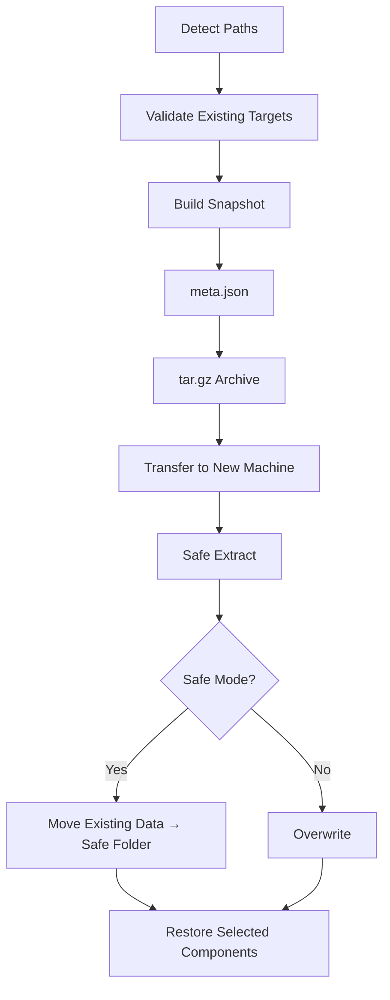

# oh-my-opencode-sync


Cross-platform **manual snapshot backup & restore system** for  
**opencode + oh-my-opencode workspace continuity**

---

## 📌 Project Overview

This project was designed from a real workflow problem:

> “I want to continue my AI coding session on any machine — safely.”

AI coding environments store critical state in:

- config
- local database / data
- cache
- workspace `.opencode`

These are **not tracked by Git**, and switching machines breaks context.

So instead of auto-sync (which can corrupt sessions),  
this project provides a:

### 🎯 Controlled, Safe, Manual Snapshot System

You decide:

- when to back up
- what to restore
- where to move your session

---

## ✨ Core Features

- Full backup / selective backup
- Full restore / selective restore
- 🛡 Safe Restore Mode (rollback-ready)
- 📊 Progress + elapsed time
- 🖥 GUI + CLI auto fallback
- 🌍 Cross-platform
- ❌ No `opencode doctor` mutation
- 📦 Portable `.tar.gz` snapshot

---

## 🏗 Architecture



---

## 📂 Snapshot Structure

```
omoc-snapshot-YYYYMMDD-HHMMSS.tar.gz
 ├── config/
 ├── data/
 ├── cache/
 ├── workspace/.opencode/
 └── meta.json
```

---

## 🚀 Quick Start

### 1️⃣ Bash CLI

```bash
chmod +x cli/omoc-sync.sh
./cli/omoc-sync.sh
```

Optional dependency for better progress:

```bash
brew install pv
# or
sudo apt install pv
```

---

### 2️⃣ Python (GUI if available)

```bash
python omoc_sync.py
```

---

### 3️⃣ macOS – Install Python with Tkinter (pyenv)

```bash
chmod +x cli/install_pyenv_python_with_tk.sh
./cli/install_pyenv_python_with_tk.sh 3.11.7
```

---

## 🔁 Recommended Workflow

### On the source machine

Run backup inside your project directory.

### On the target machine

Run restore inside the same project path.

Continue working immediately.

---

## 🛡 Safe Restore Mode

Before overwrite:

```
.omoc-safe-restore-YYYYMMDD-HHMMSS/
```

Rollback anytime.

---

## 🔐 Design Philosophy

This tool **does NOT auto-sync**.

Because auto-sync can:

- corrupt sessions
- mix caches
- break AI context

Instead:

✔ Manual  
✔ Explicit  
✔ Safe  

---

## ⚠️ Notes

OAuth tokens are stored in OS keychain:

- macOS → Keychain
- Windows → Credential Manager
- Linux → keyring

Re-login may be required.

---

## 🧭 Roadmap

- Snapshot diff mode
- Scheduled backup
- Remote storage upload
- Environment profiles

---

## 🤝 Contributing / Feedback

Suggestions, issues, and improvements are always welcome.

If something is missing or can be safer, faster, or cleaner —  
please open an issue or request changes anytime.

This project is designed to evolve with real workflows.

---

## 📜 License

MIT


## ⚡ TL;DR

### Backup
```bash
./cli/omoc-sync.sh   # choose Full Backup
```

### Restore
```bash
./cli/omoc-sync.sh   # choose Full Restore (Safe Mode recommended)
```

### Python GUI
```bash
python omoc_sync.py
```


## 🌐 Multi‑Machine Workflow


---

## 📚 Docs Structure

```
docs/
 ├── architecture.md
 ├── workflow.md
 ├── backup-restore.md
 ├── safe-restore.md
 └── troubleshooting.md
```

---

## 🚧 Future Improvements / Simplification Ideas

We are actively exploring ways to make this system even safer and lighter.

### 1. Session-only backup mode
Instead of backing up the entire data/config/cache, a future mode may:

- Install `opencode → oh-my-opencode`
- Restore only:
  - essential settings
  - session state
  - workspace context

This would:

- drastically reduce snapshot size
- speed up migration
- avoid unnecessary cache transfer

### 2. Minimal portable environment profile

Another direction under consideration:

- Recreate environment via installer
- Restore only:
  - user configuration
  - active session metadata

This turns the snapshot into a **context carrier** rather than a full environment clone.

These approaches aim to:

- simplify backups
- improve cross-machine portability
- reduce failure surface

Feedback and ideas are very welcome.
