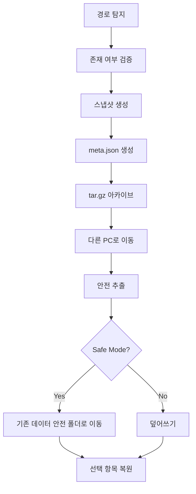

# oh-my-opencode-sync


opencode + oh-my-opencode 작업 상태를  
어느 환경에서든 안전하게 이어서 사용할 수 있도록 만든  
**크로스 플랫폼 수동 스냅샷 백업/복원 시스템**

---

## 📌 프로젝트 개요

이 프로젝트는 다음과 같은 실제 개발 흐름에서 출발했습니다.

> “AI 코딩 세션을 다른 PC에서도 그대로 이어서 작업하고 싶다.”

AI 개발 환경은 중요한 상태를 로컬에 저장합니다:

- config
- 로컬 데이터베이스 / data
- cache
- workspace `.opencode`

이 데이터들은 Git으로 관리되지 않기 때문에  
PC를 이동하면 작업 맥락이 끊어집니다.

그래서 자동 동기화 대신 다음과 같은 방식을 선택했습니다:

### 🎯 수동 · 명시적 · 안전한 스냅샷 시스템

사용자가 직접:

- 언제 백업할지
- 무엇을 복원할지
- 어떤 환경으로 이동할지

결정합니다.

---

## ✨ 핵심 기능

- 전체 백업 / 선택 백업
- 전체 복원 / 선택 복원
- 🛡 Safe Restore 모드 (롤백 가능)
- 📊 진행률 + 경과 시간 표시
- 🖥 GUI + CLI 자동 폴백
- 🌍 크로스 플랫폼 지원
- ❌ opencode doctor 미사용 (환경 변경 방지)
- 📦 이식 가능한 `.tar.gz` 스냅샷

---

## 🏗 아키텍처



---

## 📂 백업 파일 구조

```
omoc-snapshot-YYYYMMDD-HHMMSS.tar.gz
 ├── config/
 ├── data/
 ├── cache/
 ├── workspace/.opencode/
 └── meta.json
```

---

## 🚀 Quick Start

### 1️⃣ Bash CLI 실행

```bash
chmod +x cli/omoc-sync.sh
./cli/omoc-sync.sh
```

진행률 표시 향상을 위한 선택 설치:

```bash
brew install pv
# 또는
sudo apt install pv
```

---

### 2️⃣ Python 실행 (GUI 가능 시)

```bash
python omoc_sync.py
```

---

### 3️⃣ macOS – Tkinter 포함 Python 설치 (pyenv)

```bash
chmod +x cli/install_pyenv_python_with_tk.sh
./cli/install_pyenv_python_with_tk.sh 3.11.7
```

---

## 🔁 권장 워크플로우

### 기존 PC

프로젝트 폴더에서 백업 실행 → 생성된 tar.gz 이동

### 새로운 PC

같은 프로젝트 경로에서 복원 → 즉시 작업 이어서 가능

---

## 🛡 Safe Restore 모드

복원 전에 기존 데이터를 다음 위치로 이동:

```
.omoc-safe-restore-YYYYMMDD-HHMMSS/
```

문제 발생 시 롤백 가능.

---

## 🔐 설계 철학

이 도구는 자동 동기화를 하지 않습니다.

자동 동기화는 다음 문제를 만들 수 있습니다:

- 세션 충돌
- 캐시 오염
- 상태 꼬임

대신:

✔ 수동  
✔ 명시적  
✔ 안전  

한 스냅샷 기반으로 동작합니다.

---

## ⚠️ 주의사항

OAuth 토큰은 OS 보안 저장소에 저장됩니다:

- macOS → Keychain
- Windows → Credential Manager
- Linux → keyring

복원 후 재로그인이 필요할 수 있습니다.

---

## 🧭 로드맵

- 스냅샷 diff 모드
- 스케줄 백업
- 원격 저장소 업로드
- 환경 프로파일 시스템

---

## 🤝 기여 / 피드백

누락된 기능, 개선 아이디어, 버그 제보 모두 환영합니다.

실제 워크플로우 기반으로 계속 발전하는 프로젝트입니다.  
언제든 수정 요청을 주세요.

---

## 📜 라이선스

MIT


## ⚡ TL;DR

### 백업
```bash
./cli/omoc-sync.sh   # Full Backup 선택
```

### 복원
```bash
./cli/omoc-sync.sh   # Full Restore (Safe Mode 권장)
```

### Python GUI
```bash
python omoc_sync.py
```


## 🌐 멀티 머신 워크플로우


---

## 📚 Docs 폴더 구조

```
docs/
 ├── architecture.md
 ├── workflow.md
 ├── backup-restore.md
 ├── safe-restore.md
 └── troubleshooting.md
```

---

## 🚧 향후 개선 및 간소화 아이디어

현재 구조를 더 안전하고 가볍게 만들기 위한 방향을 검토 중입니다.

### 1. 세션 전용 백업 모드

전체 data/config/cache를 백업하는 대신:

- `opencode → oh-my-opencode` 재설치 후
- 다음만 복원하는 방식:

  - 핵심 설정
  - 세션 상태
  - workspace 컨텍스트

이 방식의 장점:

- 스냅샷 용량 대폭 감소
- 마이그레이션 속도 향상
- 불필요한 캐시 이동 제거

---

### 2. 최소 이식 환경 프로파일

다른 방향으로는:

- 설치 스크립트로 환경 재구성
- 다음만 복원:

  - 사용자 설정
  - 활성 세션 메타데이터

즉, 전체 환경 복제가 아니라  
**작업 컨텍스트만 이동하는 구조**를 목표로 합니다.

이러한 접근은:

- 백업 단순화
- 크로스 머신 이식성 향상
- 실패 가능성 감소

를 기대할 수 있습니다.

아이디어 및 개선 제안은 언제든지 환영합니다.
